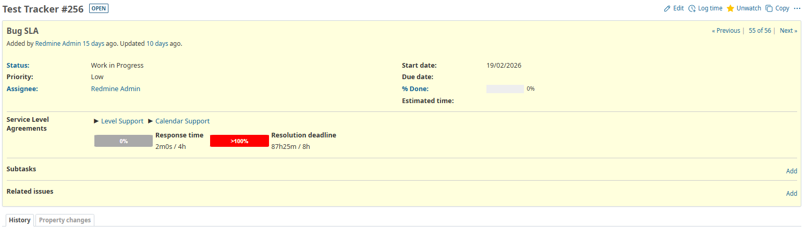
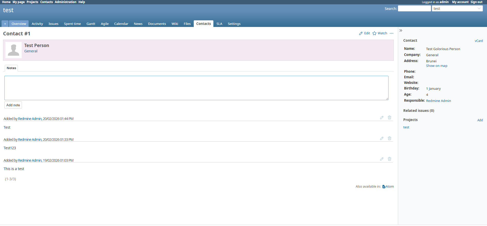
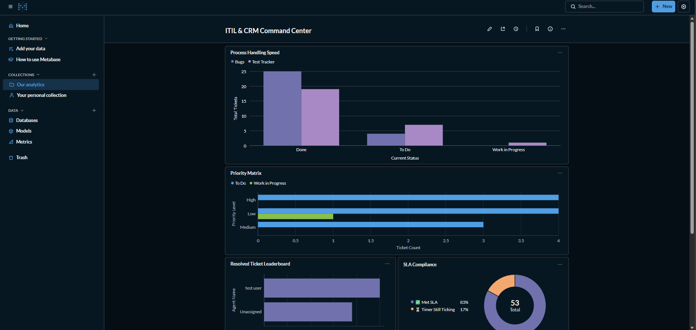
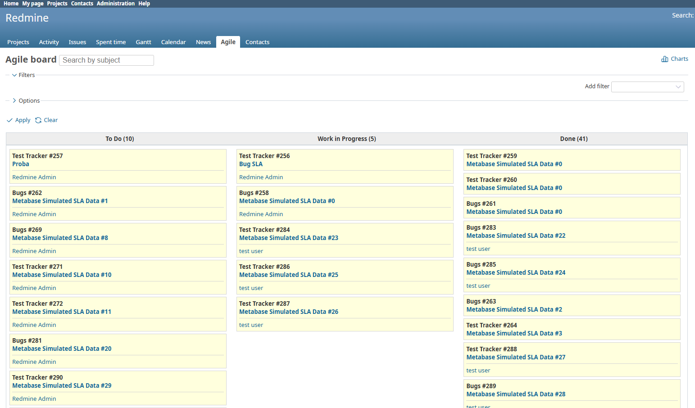
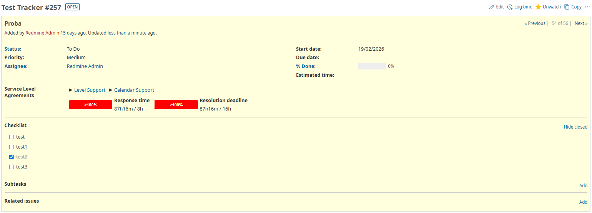

# 🚀 Redmine on AWS (Terraform + Docker)

This project allows you to deploy a secure, production-ready Redmine application to Amazon Web Services (AWS) from scratch.

The **Development approach**: We build the entire application (including plugins and dependencies) via **GitHub Actions**, which automatically pushes the Docker image to the server. This ensures "Immutable Infrastructure"—the server runs exactly what you tested locally.

There are two ways of setting up the environment:

1. **[The AWS - Cloud hosted way](#aws-setup)**
2. **[Locally via Multipass](#local-setup)**

---

## 🏢 ITIL Capabilities

This stack aims beyond basic issue tracking. By combining Redmine with specific enterprise plugins and a metrics engine, this infrastructure serves as a fully capable **IT Service Management** platform aligned with **ITIL** best practices.


Detailed description of the components of aligning to ITIL management practices:

### 1. Incident & Service Request Management (Redmine Core)
* This is handled by Redmine's base service, since its ticketing system handles the intake, prioritization, and assignment of issues. Custom workflows regulate the lifecycle of a ticket (e.g., *New → Work In Progress → Done*).

### 2. Service Level Management (SLA Plugin)
* Handled by the `redmine_sla` plugin by LikeHopper, a commonly used free alternative to RedmineUp's helpdesk plugin. It enforces Service Level Aggreements and tracks both "Time to First Response" and "Time to Resolution", all timeframes are customizable.
* It calculates SLA compliance directly at the PostgreSQL database level using PL/pgSQL. It pauses SLA timers based on customized business working hours, weekends, and corporate holidays.


*1. Shows SLA Plugin's time tracking per issue feature.*

### 3. Relationship Management (CRM Plugin)
* Handled by the `Redmine CRM` plugin provided by RedmineUP. It can link IT incidents to specific users, departments, or external companies. Support agents can be configured and they can view a client's entire ticket history and identify recurring issues tied to specific departments, rather than treating every ticket in a vacuum.


*2. Shows the CRM Plugin's contact feature, where employees can reach them.*

### 4. Measurement & Continual Improvement (Metabase)
* `Metabase` handled the Metrics and analysis. It runs alongside Redmine and connects directly to its underlying PostgreSQL database.
* **Features:** 
  * **Metrics:** Since it has direct read-access to the database, you are not limited to Redmine's built-in reports. You can write custom SQL queries to build live, auto-refreshing dashboards. The potential is limited only by the users imagination.
  * **Applications:** Track SLA breach rates, measure average resolution times per agent, visualize ticket volume by department, or build a "Live NOC" screen for the IT team.


*3. Shows Metabase's dashboard, built with custom queries, showing just a few usecases of metric reporting.*

### 5. Kanban board, Problem & Change Management (Agile & Checklists Plugins)
* The `Agile` (by RedmineUP) and `Checklists` plugin deal with interactive issue management. The `redmine_agile` plugin provides Kanban boards to help engineering teams track long-term root-cause fixes. The `redmine_checklists` plugin ensures that standard operating procedures (SOPs) are strictly followed during complex system changes or post-mortem reviews.


*4. Shows the Kanban board provided by the Agile Plugin.*



*5. Shows the Checklist Plugin's feature implemented on an issue*

---
## 📁 Project Structure

```bash
.
└── redmine_app/
   ├── .github/workflows/
   │   └── deploy.yml ⬅ The CI/CD Pipeline script for image building and deployment
   ├── backup/
   │   ├── Dockerfile ⬅ Builds a lightweight image that runs the db backup script
   │   └── script.sh ⬅ Dumps the Postgre DB to an AWS S3 Bucket
   ├── config/
   │   ├── configuration.yml ⬅ Redmine core config file
   │   └── database.yml ⬅ DB Connection and authentication for Redmine
   ├── plugins/ ⬅ Plguins for Redmine
   │   ├── redmine_agile
   │   ├── redmine_checklists
   │   ├── redmine_contacts
   │   └── redmine_sla
   ├── .gitignore
   ├── Dockerfile ⬅ Builds a custom Redmine image, including the plugins and Ruby dependencies
   ├── README.md
   ├── cloud-init.yaml
   ├── docker-compose.yml
   ├── docker-entrypoint.sh ⬅ Custom startup script for Redmine that ensure DB migrations before booting
   └── main.tf
```

---

## 🛠️ Step 0: Prerequisites

1.  **[Docker Desktop](https://www.docker.com/products/docker-desktop/)**: Required to build the application image.
2.  **[Terraform](https://developer.hashicorp.com/terraform/downloads)**: Required to create the server on AWS automatically.
3.  **[AWS CLI](https://aws.amazon.com/cli/)**: Required to connect your computer to your AWS account.
4.  **Git**: To download this project.

---

<div id="aws-setup"></div>

## 🔑 Step 1: Connect to AWS

Terraform needs permission to create servers in your AWS account.

1.  **Create an AWS Account:** If you don't have one, sign up at [aws.amazon.com](https://aws.amazon.com).
2.  **Create Access Keys:**
    - Go to the **IAM Dashboard** in the AWS Console.
    - Click **Users** > **Create User** (name it `terraform-user`).
    - Attach policies: Select **AdministratorAccess**.
    - Once created, go to the user's **Security Credentials** tab.
    - Click **Create Access Key**.
    - **SAVE the Access Key ID and Secret Access Key.**
3.  **Configure your Computer:**
    Open your terminal and run:
    ```bash
    aws configure
    ```

    - **AWS Access Key ID:** Paste your key.
    - **AWS Secret Access Key:** Paste your secret.
    - **Default region name:** `us-east-1` (or your preferred region).
    - **Default output format:** `json`

---

## 🔐 Step 2: Create SSH Keys

Needed for secure remote connection to the server.

1.  Open your terminal.
2.  Run this command and go through the config process:
    ```bash
    ssh-keygen -t rsa -b 4096
    ```
3.  This creates two files in a hidden folder: `~/.ssh/id_rsa` (private) and `~/.ssh/id_rsa.pub` (public). Terraform will use these automatically.

---

## ⚙️ Step 3: Project Setup

1.  **Clone this repository:**

    ```bash
    git clone https://github.com/xdd1122/redmine_app.git
    cd redmine_app
    ```

2.  **Create the Environment file:**
    Create a new file named `.env` in the project folder. Paste the following into it and change the passwords:

    ```bash
    # .env
    REDMINE_VERSION=6.0.8
    POSTGRES_VERSION=15-alpine
    REDMINE_PORT=3000

    # Database
    POSTGRES_USER=redmine
    POSTGRES_PASSWORD=your_pass     #change
    POSTGRES_DB=redmine
    REDMINE_DB_POSTGRES=db
    REDMINE_SECRET_KEY_BASE=generate_secret     #change

    # Email setup
    SMTP_HOST=smtp.office365.com
    SMTP_PORT=587
    SMTP_USER=your_user@example.com     #change
    SMTP_PASS=your_user_password    #change
    SMTP_DOMAIN=yourcompany.com     #change
    SMTP_AUTHENTICATION=login
    EMAIL_DELIVERY_METHOD=smtp
    SMTP_ENABLE_STARTTLS_AUTO=true
    ```

---

## 🏗️ Step 4: Deploy Infrastructure (Terraform)

_Only run this once to create the server._

1.  **Initialize & Apply:**

    ```bash
    terraform init
    terraform apply
    ```

    _(Type `yes` when asked)_

2.  **Get the IP:**
    Terraform will output the server IP. You will need this for the next step.

---

## 🤖 Step 5: Configure GitHub Secrets

For the CI/CD pipeline to work, you must add these secrets to your GitHub Repository.
Go to **Settings** > **Secrets and variables** > **Actions** and add:

| Secret Name       | Value                                |
| :---------------- | :----------------------------------- |
| `DOCKER_USERNAME` | Your Docker Hub Username             |
| `DOCKER_TOKEN`    | Your Docker Hub Access Token         |
| `SSH_HOST`        | The AWS IP Address from Step 4       |
| `SSH_USER`        | `ubuntu`                             |
| `SSH_KEY`         | Content of your `~/.ssh/id_rsa` file |

---

## 🚀 CI/CD Pipeline (Automated Deployment)

This project uses **GitHub Actions** for a fully automated DevOps pipeline. You do not need to manually build or copy Docker images.

### How it works:

1.  **Continuous Integration (CI):** When you push code to the `main` branch, GitHub Actions automatically builds the Docker image and pushes it to Docker Hub.
2.  **Continuous Deployment (CD):** After a successful build, the pipeline logs into the AWS server via SSH, pulls the new image, and restarts the application with zero downtime.

### 🔄 How to Update the App

1.  Make changes to your code locally.
2.  Commit and push:
    ```bash
    git add .
    git commit -m "Added a new feature"
    git push origin main
    ```
3.  Wait ~3 minutes, and the changes will be live on your server.

---

## 🌐 Accessing Your App

1.  Copy the `app_url` from the Terraform output and paste it into your browser.
2.  **Default Login:**
    - **User:** `admin`
    - **Password:** `admin`

---

## 🛑 How to Delete Everything

To stop the server and stop paying for AWS resources:

```bash
terraform destroy
```

---

<div id="local-setup"></div>

## 💻 Local Testing (Multipass)

If you don't want to use AWS, or just want to test your configuration for free, you can simulate the **environment** locally using [Multipass](https://multipass.run/). This creates an Ubuntu VM on your computer that acts just like the AWS server.

### 1. Install Multipass

- **MacOS/Windows:** Download the installer from [multipass.run](https://multipass.run/).
- **Linux:** `sudo snap install multipass`

### 2. Prepare the Cloud-Init

The `cloud-init.yaml` file is designed for Terraform (which injects your SSH key). For local use, create a copy that is safe for Multipass:

```bash
# Create a local version
cp cloud-init.yaml cloud-init-local.yaml
```

### 3. Edit _cloud-init-local.yaml_

Open the file and remove the _ssh_authorized_keys_ section, as Multipass handles keys differently.

### 4. Launch the VM

```bash
# This installs Docker and sets up permissions automatically
multipass launch jammy --name redmine-local --cpus 2 --mem 2G --disk 10G --cloud-init cloud-init-local.yaml

# 2. Check the status
multipass info redmine-local
```

### 5. Access Redmine

Find the IP of the VM

```bash
multipass list
```

- Copy the IP and open http://IPofVM:3000 in your browser

### 6. Cleanup

```bash
multipass delete redmine-local
multipass purge
```
